<div align="center">



</div>

<br/>

> **Permanently and irreversibly destroys data on any storage device using cryptographic key destruction — no installed OS required.**

A standalone, bootable tool for secure IT asset recycling and data retention compliance. Instead of slow multi-pass physical overwriting, it encrypts the entire device with a throwaway LUKS2 key and then destroys the key — rendering every bit on the disk forensically unrecoverable in seconds.

The storage itself is never touched. Only the key is destroyed. Without it, the ciphertext left behind is mathematically indistinguishable from random noise.

<br/>

---

## ⚡ How It Works

<div align="center">


</div>
---

## Features

**Cryptographic Destruction**
LUKS2 + AES-XTS-256 full-disk encryption, followed by irreversible key destruction — no multi-pass overwrite needed.

**Interactive Device Selection**
Guided prompts for picking the exact device or partition, reducing the risk of wiping the wrong drive.

**SystemRescue Compatible**
Drop the binary onto any SystemRescue USB and run it directly from a bootable environment — no host OS required.

**512-bit Key Material**
SHA-256 hashing and a randomly generated 512-bit key, used once and then destroyed.

---

## Build

```bash
# Install Rust
curl --proto '=https' --tlsv1.2 -sSf https://sh.rustup.rs | sh
source ~/.cargo/env

# Install dependencies (Ubuntu/Debian)
sudo apt update
sudo apt install cryptsetup build-essential

# Clone and build
git clone https://github.com/YugRokadia/Secure-Data-Wiping-for-Trustworthy-IT-Asset-Recycling.git
cd Secure-Data-Wiping-for-Trustworthy-IT-Asset-Recycling
cargo build --release

# Binary will be at: target/release/secure-wipe
```

## Usage

```bash
# Interactive mode — guided device selection
sudo ./target/release/secure-wipe

# Direct mode — target a specific device
sudo ./target/release/secure-wipe /dev/sdX

# With options
sudo ./target/release/secure-wipe /dev/sdX --force --verify
```

## SystemRescue USB Deployment

```bash
# Copy the tool onto an existing SystemRescue USB
cp target/release/secure-wipe /media/user/RESCUE1202/

# Boot SystemRescue, then:
mount /dev/sdb1 /mnt && cp /mnt/secure-wipe /tmp/ && chmod +x /tmp/secure-wipe && /tmp/secure-wipe
```

---

## Warning

**This tool permanently and irreversibly destroys all data on the selected device.** There is no undo. Always double-check the target device path before confirming.

---

## Security Details

| Component | Spec |
|---|---|
| Encryption | LUKS2, AES-XTS-256 |
| Key size | 512-bit |
| Hashing | SHA-256 |
| Key handling | Generated, used once, then destroyed |
| Recoverability | Forensically unrecoverable post key-destruction |

---

<div align="center">
<sub>Built for Smart India Hackathon — Secure Data Destruction for Trustworthy IT Asset Recycling</sub>
</div>
